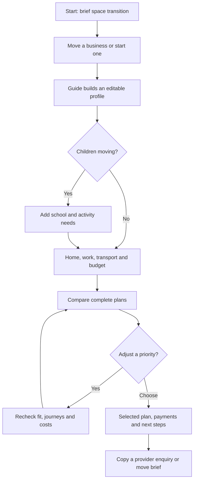

# Marhaba product and implementation reference

Marhaba, originally described as Settled, helps international founders answer: **Can Abu Dhabi work for our business, household and money?** The sample is a founder relocating with a working partner and one school-age child. The current planner also supports solo founders, childless households, single parents and up to 20 children with individual ages.

## Experience

1. Begin with an empty warm white page and choose **Scale my business** or **Start a new business**. Pressing the start action plays a quiet two-note chirp. A small cursor-following animation appears on this page only for mouse users without reduced motion. A separate sample restores a fictional founder family.
2. Answer six quick prompts for a solo move or eight with children. Child count and individual ages share one card with Add/Remove controls; bedrooms share the neighbourhood card. A vertical black branching timeline sits on the left and a compact question on the right. Confirm answers to update plans, revisit details through branches, and resume the precise saved question after reload. Long card content scrolls while actions remain available; phones use normal page flow.
3. Compare complete plans for preserving cash, reducing travel and balancing family priorities. Compact local and results sketches connect places with animated red lines and prepared travel estimates; work, school, food and hobby layers can be toggled without changing plan facts. Inspect the same plan's costs and requirement checks.
4. Change a meaningful choice, such as removing the car, and see plans, journeys and money recalculate.
5. Choose a plan; inspect monthly spending and payment timing, prepare phased tasks and human enquiries, and print or copy the result with its assumptions.
6. Open **Nori at work** for an iMessage-style two-bedroom enquiry between Nori and Amaya, an estate-agent demo persona. Blue/gray bubbles and recorded voice messages make it feel like a conversation; a small demo label preserves its simulated status. Text loops every 22 seconds; Pause and Replay control the case. Click the provided Nori WAV or estate-agent MP3 to listen; playback pauses the conversation. It sends no messages and leaves the plan unchanged. Recordings are local assets; ElevenLabs is not connected live.

Nori is Marhaba's guide: a sage-and-cream SVG gazelle with big eyes, gentle blinks, a waving hoof and a springy hop at each question. A short local thinking transition connects prompts; clicking Nori opens Luna chat. Warm white, black text, strong Inter typography and neutral surfaces define the current visual direction. Reduced motion removes decorative movement and prompt delays.

Structured questions work without live AI. Optional `gpt-6-luna` chat runs through a server-only `OPENAI_API_KEY`, explains deterministic results and offers reviewable answer changes. The user must apply each proposal; outdated proposals cannot overwrite newer answers. Local setup and verification commands are in [README.md](README.md).

## Planning and trust

- Apply essential requirements first. Met, not met and unknown remain distinct; unknown essential details produce a conditional plan. A no-match state reports conflicts rather than silently changing constraints.
- Keep home, founder workplace, partner workplace, school, activities and transport in one combination. A school drop-off is a chained journey. School-bus coverage is checked independently from nearby public buses.
- Use four supported Abu Dhabi areas, eleven demo homes, six fictional schools, three workplace anchors and sample service profiles. Catalogue prices, admission assumptions and journeys are demonstration data.
- Hub71 is the primary documented ecosystem anchor at Al Khatem Tower, ADGM Square, Al Maryah Island. Its approximate map pin refers to the [official address](https://www.hub71.com/contact). Synthetic workspace allowances are not Hub71 prices; programme admission, benefits and actual workspace availability need confirmation.
- Leaflet/OpenStreetMap provides geographic context. Nearby hospitals, supermarkets, public stops and hobby venues are explicitly demo pins. Straight-line proximity does not establish routes, access, opening hours, fees or insurance coverage. The list remains available without street tiles.
- Prepare human handoffs without pretending to send messages. Housing contacts use clearly masked UAE-format numbers. Business, school, housing and document-preparation profiles are fictional.

## Money and banking

Store money as integer fils and display AED. Separate household and business accounts, average costs and dated cash events. Rent uses quarterly payments and school fees use three instalments; monthly equivalents appear only in the average-cost view. Refundable deposits reduce available cash without an assumed refund. Founder pay is an internal transfer with matching entries.

Use the selected arrival date for the payment schedule. When arrival is undecided, use the editable planning reference and label the dates illustrative. Build 12 months of events and assess cash at payment dates; unknown opening cash or receipts leave balances unavailable. Unquoted business setup or specialist costs remain excluded and visible as partial totals. The supplied arithmetic fixture remains AED 33,600 initial payments, AED 66,400 remaining cash and AED 13,000 average monthly expenses.

The spending graph is available before cash or income is supplied. Monthly spending shows cost equivalents; payment timing shows dated expenses and deposits once each. Selecting a period reveals its amounts. This graph shows spending, while a balance forecast still requires known cash and receipts. The budget prompt offers synthetic plan examples as an optional draft starting point.

Banking stays outside relocation calculations. It records existing bank names, personal/business account interest, optional current bureau score, feature preferences and optional residency. Demo bundles organise questions about fees, savings, cashback, transfers, company accounts and funding. No score bands, credit limits, offers or approval decisions are inferred; hobbies never affect banking results. Users control whether their names of banks and supplied score appear in copied questions. [Etihad Credit Bureau](https://etihadbureau.ae/Individual/CreditScore) currently states a 300–850 score range; [CBUAE responsible financing standards](https://rulebook.centralbank.ae/en/rulebook/article-7-responsible-financing-practice-1) provide the official assessment reference.

## Current limits and next work

The core must remain usable with every external connection disconnected. Connections are honest previews, not successful authentication or live sync. Relocation and banking persist independently on the device and have explicit reset controls; no accounts, shared household workspace or server database are implemented.

Children have individual retained ages, with one shared curriculum and school as an explicit planning approximation. School-age children contribute per-child fees; nursery and further education need separate quotes. Routes remain prepared estimates. There is no current property inventory, confirmed school admission, insurance quote, bank application or provider outreach; the agent conversations are scripted demonstrations. Document help currently prepares checklists only. Uploads, storage and sharing of passports or company files are future work requiring secure authentication, access controls and deletion behaviour. Production routing, source refresh, consented connectors and reviewed eligibility logic are later integrations.

---

## Archived planning draft — superseded

The following draft records an earlier hackathon proposal. Its naming, palette, mascot, entry animation and schedule are historical. The current Marhaba reference above and the latest user instructions control implementation.

Settled: Abu Dhabi hackathon brief
Planning document only. No application has been built or deployed in this task.
Deadline: 2 October 2026, 14:30 Asia/Dubai. The schedule below starts at 10:55 and preserves time for deployment, verification and rehearsal.
1. What the attachments describe
The two attachments are consecutive parts of one specification: sections 1–28 and sections 29–49. The second develops the interaction and screen details; it is not a competing product.
Settled helps a founder plan a business and a life in Abu Dhabi together.
Promise: Make Abu Dhabi work for your business and your family.
Initial audience: international technology founders moving with a partner and one school-age child. Solo founders can use the same experience with family questions omitted.
The app connects business/workspace, home, school, transport, activities and money. Its output is a small number of complete scenarios, each showing what fits, the main compromise, upfront payments, average ongoing spending, important unknowns and practical next steps.
Use the guided concierge concept as the main experience. Borrow a small location view and financial comparison from the other concepts, rather than building three products.
The key demonstration is changing one assumption: remove the car and watch the available home/school/work combinations, journeys and costs change together.
2. Latest decisions override the old brief
- Replace every monochrome/black-and-white visual instruction in the attachments with a cute, colourful visual direction.
- Include a short space-inspired transition after pressing Start, then a clear and readable planning workspace.
- Use Nori, a small golden star with peach cheeks and a tiny orbit, as the friendly mascot. Keep Nori beside questions or docked beside results, where it cannot obscure controls.
- Do not build a read-aloud feature.
- ElevenLabs is optional for the guide's short voice lines, after the complete demo works. Voice must be user-enabled and easy to mute.
- Reserve Luna for the very last small task: wording or a cosmetic consistency pass. Use the main coding model for implementation, calculations, debugging and deployment. Final verification remains necessary after any edit.
- Continue targeting Vercel for hosting.
- Do not implement the app until separately instructed to begin.
3. User journey

Provide a sample founder household from the first screen so judges can reach the comparison quickly. Every answer should visibly update the profile. A long mandatory interview would hide the product's best interaction.
4. Five screens for the demo
Screen	Required outcome
Welcome	Understand the promise; choose starting/moving or load sample; short space transition
Your move	Compact guided inputs and a visible editable profile
Compare	Up to three distinct valid plans; show benefits, compromises, costs and unknowns
Plan detail	Selected locations, simple money breakdown, no-car adjustment and undo
Next steps	Business action, housing/school confirmation tasks, copyable enquiry and plan

The core quick inputs are business intent, activity/workspace need, household, workplace anchors, housing budget, school stage/curriculum if relevant, transport and top priority. Group related fields into compact sections. Exact finances can remain optional.
Keep starting and moving paths useful, but use a single shared planner after the initial business context. The sample family is the deepest supported scenario. Solo mode skips school questions, school costs and school tasks.
5. The smallest convincing build
Must work:
1. Sample scenario, compact inputs, edit/back and reset.
2. Small bundled synthetic dataset; for example three districts, six homes, three fictional schools and two workplaces.
3. Complete plan comparison with objectives such as More breathing room, Less time commuting and A balanced landing. Explain each objective in ordinary terms.
4. Check essential requirements first; rank preferences afterwards. Track met, not met and unknown. Return fewer plans when appropriate.
5. A no-car control that actually recalculates suitability, travel and money; show a concise before/after explanation and undo.
6. Upfront payments and average monthly costs, with household and business figures kept distinct.
7. Small schematic location view, with the same information available as a list. Label lines as plan connections and travel times as illustrative estimates.
8. Selected-plan summary, next three actions, school/housing enquiry copy and a master move brief.
9. Mobile readability, keyboard access, visible demo labels and reliable sample/reset controls.
Defer Connections/MCP pages, live listings, real routing, bookings, payments, provider messaging, accounts, uploaded-document parsing, calendar imports, multi-child complexity, organisation dashboards and a comprehensive legal eligibility engine. A 12-month event-level cash chart is a stretch goal after a correct supported cost comparison.
6. Improvements that sharpen the idea
Make business setup visible. Every selected plan should include a business/workspace arrangement and a first official action to investigate. The housing and school story should support the founder's move, while the business goal remains visible.
Reveal changes clearly. Place a small “What changed” explanation beside the no-car control: one plan is unsupported, another remains possible, travel differs and the transport budget changes. Do not rely on the judge noticing a new total.
Show a dependency, not just a task list. For example, “Confirm school-bus coverage before committing to this home.” This explains why the app connects decisions.
Keep costs honest. Annual rent divided by twelve is useful for average cost, but it is not an extra monthly cash payment when actual instalments are already deducted. Deposits affect available cash separately. Unknown costs remain marked as quotes needed. Missing cash balances mean no affordability or runway claim.
Use fewer useful inputs. Show an outline early; let detailed finances improve it later. “Not sure yet” is a valid state.
Use the character to communicate consequences. Personality should help the user understand the next decision. The numerical engine must remain separate from the guide and any model output.
Keep the demo focused. One household, one consequential change and one actionable handoff are enough for a coherent two-minute presentation. If the judging rules require live AI, account for that before implementation; a scripted guide and AI-assisted coding do not by themselves constitute live AI in the app.
7. Selected mascot: Nori
Nori is a little golden star with peach cheeks and a tiny orbit. Nori is warm, curious and helpful, and fits the space-inspired Start transition.
Use Nori throughout today's build. Two or three simple states are sufficient: idle, considering and happy. Small blinks and a short entrance are enough; avoid constant movement.
Suggested Nori lines:
- “Let's find your place in Abu Dhabi.”
- “Who is coming along?”
- “What matters most: more breathing room or less travel?”
- “No car? Let's check which plans still work.”
- “Here's the next thing to confirm.”
8. Colour and space direction
Role	Colour
Main violet/action	#6D4AFF
Lavender background	#F3EFFF
Sky blue/location accent	#6CCBFF
Peach/character accent	#FFB38A
Mint/positive detail	#90E3C2
Soft gold/stars	#FFE08A
Deep plum/text	#30254D

Use light panels, readable deep-plum text, soft corners, clear numbers and a consistent small icon set. Pale accent colours are decorative fills, not body-text colours. Essential statuses need written labels alongside colour.
Interpret the space reference as a short violet-sky entry, tiny stars, an orbiting guide and an Abu Dhabi destination. On Start, transition into the actual question/profile workspace in roughly one second. Do not make users wait through a fake research/loading sequence. Respect reduced-motion preferences and keep the core experience usable without animation.
9. Voice and model decisions
There is no read-aloud button and no automatic narration of plans, forms or financial figures.
For the hackathon, the lightest voice option is three to five prerecorded character lines, generated in ElevenLabs and downloaded as MP3. Add them only once the comparison works. Use a warm, playful and clear voice rather than an exaggerated baby voice. Start silent; let the user enable the guide's voice.
Recorded phrases should avoid changing numbers or claiming to describe live calculations. Dynamic consequences remain visible as text. Full conversational voice is a later enhancement unless it is already available and quick to integrate.
Luna is reserved for the final small copy/cosmetic task. Do not hand core planning logic, money calculations, architecture, deployment or unresolved bugs to that last pass.
10. Deadline plan
All times are Asia/Dubai, 2 October 2026. This is a proposed schedule for the later build, not work already completed.
Time	Work	Checkpoint
10:55–11:10	Freeze scope and character; create repository/project; connect GitHub to Vercel	First minimal Vercel preview opens
11:10–11:45	Welcome, basic space transition, compact questions, sample profile and edit controls	Sample can reach a results screen
11:45–12:30	Synthetic data, requirement checks and complete-plan comparison	Distinct plans have real derived differences
12:30–13:00	No-car recalculation, undo, upfront/monthly money and explanatory text	Signature demo works end to end
13:00–13:20	Selected plan, business action, next steps and copyable enquiry	User leaves with useful actions
13:20–13:40	Schematic locations, mobile layout and character polish; optional voice only if ready	Pleasant, readable and reliable UI
13:40–14:00	Verify updated Vercel deployment; fix build/runtime problems	Deployed full journey works
14:00–14:15	Test sample/reset, solo mode, no-car, no-match, money and phone layout	Demo is repeatable
14:15–14:20	Luna final micro-pass on wording/cosmetic consistency only	Check any resulting edits immediately
14:20–14:30	Rehearse, prepare backup screenshots/recording and submit	Working URL and presentation ready

If starting later, shorten optional map/voice/polish work first. Keep time for deployment, verification and submission. At 12:30, drop optional integrations if the comparison is not ready. At 13:40, stop adding features and focus on deployed reliability.
The direct Vercel plugin was unavailable in this workspace at the earlier check. The GitHub-to-Vercel route remains the proposed deployment path. Account authorization and project import may require the user's action; do these early.
11. Handing this to Codex
Save or add this document as settled-hackathon-brief.md in the coding project. The original files can remain as reference, but this document controls today's scope and style. Avoid repeatedly pasting all 49 sections into chat; it increases the chance of building deferred features or restoring the old visual direction.
When ready to start implementation, use this instruction:
Read settled-hackathon-brief.md as the controlling brief for today's Settled prototype. It overrides the original monochrome design and broad feature scope. Build the complete sample founder-family journey first: profile, complete-plan comparison, working no-car recalculation, separate upfront/monthly costs, selected plan, business next action and copyable enquiry. Use cute colour, Nori the golden-star mascot and a short space transition. No read-aloud. Voice is optional after the core works. Reserve Luna for the final small copy/cosmetic task. Keep demo data and unknowns explicit. Target Vercel and get a deployment checkpoint early. Do not claim live services or messaging unless actually implemented.

12. Two-minute judge demonstration
Duration	Demonstration
0:00–0:15	Explain that starting a business also involves making household decisions work together
0:15–0:35	Press Start, show the guide, load the sample founder/partner/child and visible profile
0:35–1:00	Compare complete plans, explaining one benefit and one compromise
1:00–1:30	Remove the car; show changed suitability, travel and money with the reason
1:30–1:50	Choose a plan; show a business action, confirmation dependencies and copied school enquiry
1:50–2:00	State that this is a demonstration dataset; explain the path to future live data and assistance

Pitch idea: Settled connects the decisions behind starting a business and settling a household in Abu Dhabi, so founders can compare workable plans and understand what to do next.
13. Official references checked for the planning advice
- ADDED: establishing your business: official business-setup guide and TAMM direction. Use as an action/reference destination, not a simulated connected service.
- Vercel: Git deployment: importing a Git repository and automatic deployments after connection.
- ElevenLabs: downloading generated speech: MP3/WAV download supports the optional prerecorded-guide approach.
References checked 2 October 2026. Costs, schools, homes and journey values for the prototype should be labelled synthetic unless independently sourced.
